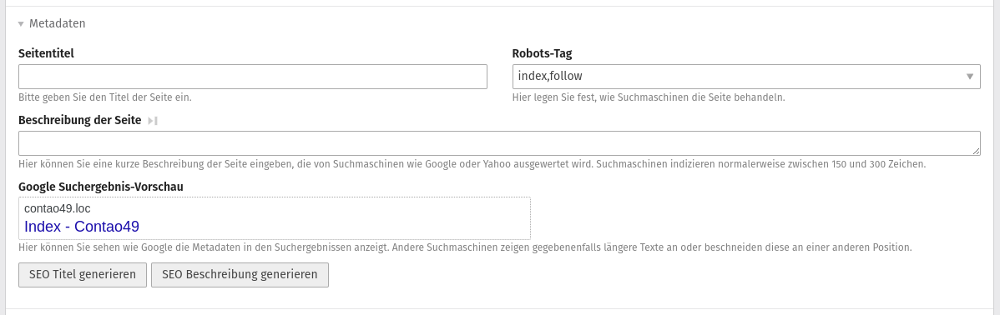
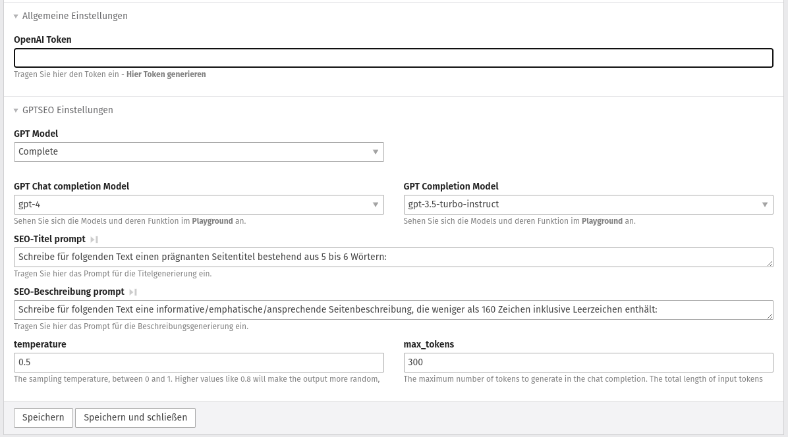

# Contao OpenAI Bundle

The purpose of this extension is to quickly and easily generate meta descriptions and titles from page content using ChatGPT (OpenAI).

Below we have summarized a few best practices to achieve relatively good results.
Additional features are planned in the future that will make the expansion even better.

## Getting started


```
composer require cubex-hro/contao-openai-bundle
```

## Compability

| Contao Version | PHP Version |
|----------------|-------------|
| \>= 4.9        | ^7.0 ǀǀ ^8.0 |


## Important note

- An OpenAI developer account is required. Sign up [here](https://platform.openai.com/signup). 
- The required token is also created [there](https://platform.openai.com/account/api-keys).
- There is a fee to use the OpenAI API. An overview of OpenAI pricing can be found here: [https://openai.com/pricing](https://openai.com/pricing)
- We tested a lot and so far we haven't gotten more than $5 a month

## Screenshots



## Best practise



- define usage limit in OpenAPI API Backend to have control over costs


## How to use

- [ ] Insert token
- [ ] Choose GPT model
- [ ] Insert preferred Meta-title prompt (e.g. Schreibe für folgenden Text einen prägnanten Seitentitel bestehend aus 5 bis 6 Wörtern:)
- [ ] Insert preferred Meta-description prompt (e.g. Schreibe für folgenden Text eine informative/emphatische/ansprechende Seitenbeschreibung, die weniger als 160 Zeichen inklusive Leerzeichen enthält:)
- [ ] Set temperature (recommended: 0.5)
- [ ] Set max_tokens (recommended: 300)
- [ ] Set optional settings like hidden elements and custom fields
- [ ] Go to page settings and use the buttons below SERP preview
- [ ] Enjoy the magic :)

## To-Do

- [ ] Integrate token calculator (e.g. [GPT-3-Encoder-PHP](https://github.com/CodeRevolutionPlugins/GPT-3-Encoder-PHP))
- [ ] Content weighting through ChatGPT as pre-fetch event
- [ ] Define personality profile (role) for Chat completions API model
- [ ] Considerations and testing for the actual maximum character length for the request
- [ ] Considerations on how serialized content will be handled in the future
- [ ] Make costs per Request more transparent (show used tokens and calculate with OpenAI pricing)
- [ ] do
- [ ] some
- [ ] [magic🪄](https://media.tenor.com/IOEsG9ldvhAAAAAd/mr-bean.gif)

## new Features
- v0.2.0 -> TinyMCE AI-Text generation Dialog
- v1.0.0 -> add Contao 5 compatibility 
- v1.1.0 -> Contao Backend Help Bot powered by CustomGPT

## Support
Contao Gpt Bundle is a project for the community. If you have suggestions for improvements or comments, use the issues or, best of all, make a pull request.